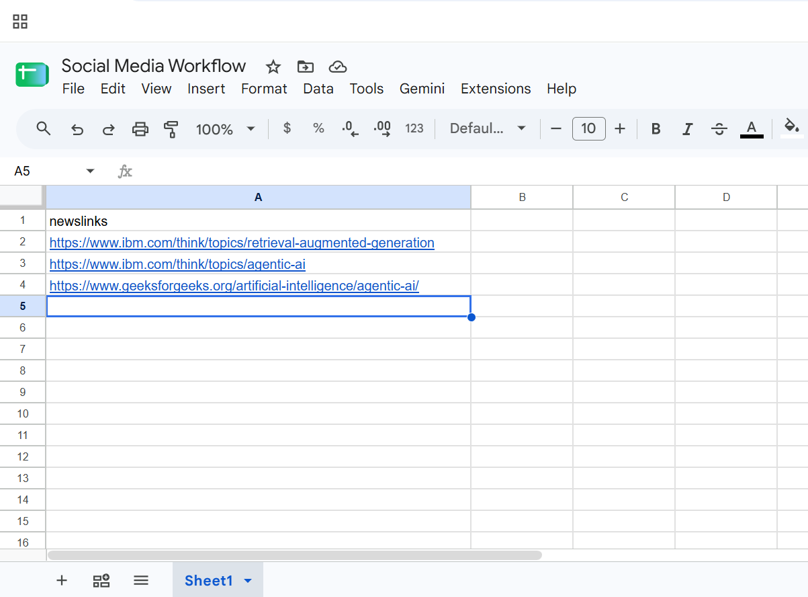
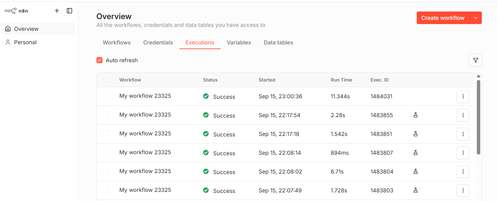

# AI-Powered LinkedIn Content Publishing Pipeline with AI Image Generation

An end-to-end AI-powered LinkedIn content publishing workflow that automatically transforms web articles into professional LinkedIn posts and generates accompanying AI-powered visuals using Google Gemini, Hugging Face Stable Diffusion, LinkedIn APIs, and n8n.

---

## Overview

This project automates the entire content creation and publishing process for LinkedIn.

Instead of manually reading articles, drafting posts, creating visuals, and publishing content, the workflow performs every step automatically.

Starting from a simple article URL stored in Google Sheets, the system:

- Summarizes the article using Google Gemini
- Creates a professional LinkedIn post
- Generates an AI image prompt
- Creates a custom image using Stable Diffusion
- Publishes the final LinkedIn post with the generated image attached

The result is a fully automated AI-assisted social media publishing pipeline.

---

## What's New in Version 2

Version 2 significantly expands the workflow capabilities by introducing automated AI image generation.

### New Enhancements

- AI-generated image creation for LinkedIn content
- Hugging Face Inference API integration
- Stable Diffusion image generation
- Automated image attachment during LinkedIn publishing
- Binary image handling inside n8n
- Multi-stage AI orchestration workflow
- Enhanced social media engagement through visual content

---

## Problem Statement

Creating professional LinkedIn content consistently requires multiple manual steps:

- Reading articles
- Summarizing information
- Writing social media content
- Creating visuals
- Publishing content
- Maintaining consistency

This project eliminates repetitive manual effort through workflow automation and generative AI.

---

## Key Features

- Automated article ingestion through Google Sheets
- AI-powered article summarization using Google Gemini
- Automated LinkedIn content generation
- AI image prompt generation
- Stable Diffusion image creation
- Automated LinkedIn publishing
- Automated LinkedIn image attachment
- OAuth 2.0 secured integrations
- Event-driven workflow automation using n8n
- End-to-end content generation pipeline
- Zero manual intervention after article submission

---

## Workflow

### Version 1

1. Add article URL to Google Sheets
2. Google Sheets Trigger detects the new entry
3. Gemini summarizes the article
4. LinkedIn post is generated
5. Content is published automatically

### Version 2

1. Add article URL to Google Sheets
2. Google Sheets Trigger detects the new entry
3. Gemini summarizes the article
4. Gemini generates LinkedIn content
5. Gemini generates an image prompt
6. Hugging Face Stable Diffusion creates an image
7. LinkedIn publishes both text and image automatically

---

## Architecture

```text
Article URL
      ↓
Google Sheets
      ↓
Google Sheets Trigger
      ↓
Summarize Articles
      ↓
Create LinkedIn Post
      ↓
Generate Image Prompt
      ↓
Hugging Face Stable Diffusion
      ↓
LinkedIn API
      ↓
Published LinkedIn Post + AI Image
```

---

## Detailed Technical Architecture

```text
┌──────────────────────┐
│ Google Sheets Trigger│
└──────────┬───────────┘
           │
           ▼
┌──────────────────────┐
│  Summarize Articles  │
│    Google Gemini     │
└──────────┬───────────┘
           │
           ▼
┌──────────────────────┐
│ Create LinkedIn Post │
│    Google Gemini     │
└──────────┬───────────┘
           │
           ▼
┌──────────────────────┐
│ Generate Image Prompt│
│    Google Gemini     │
└──────────┬───────────┘
           │
           ▼
┌──────────────────────┐
│ Hugging Face API     │
│ Stable Diffusion 3   │
└──────────┬───────────┘
           │
           ▼
┌──────────────────────┐
│   LinkedIn Publish   │
│ Text + Image         │
└──────────────────────┘
```

---

## Technologies Used

### Cloud & APIs

- Google Cloud Platform
- Google Sheets API
- Gmail OAuth 2.0
- Google OAuth 2.0
- LinkedIn API
- LinkedIn OAuth 2.0
- Hugging Face Inference API

### Artificial Intelligence

- Google Gemini
- Stable Diffusion 3 Medium Diffusers
- Prompt Engineering
- Generative AI

### Automation

- n8n
- Workflow Automation
- Event-Driven Workflows

---

## Engineering Highlights

- Built a multi-stage AI content generation pipeline
- Automated article summarization using Gemini
- Automated LinkedIn content generation
- Automated image prompt generation
- Integrated Stable Diffusion image generation
- Implemented Hugging Face Inference API integration
- Configured LinkedIn media publishing
- Implemented binary image processing within n8n
- Orchestrated multiple AI services within a single workflow
- Integrated four external platforms into one automation pipeline
- Designed a scalable AI-assisted content publishing architecture

---

## Challenges Faced

### Google Integration

- Configuring Google OAuth Consent Screen
- Creating Google OAuth Credentials
- Resolving refresh-token authentication issues

### Gemini Configuration

- Managing model selection
- Handling quota limitations
- Resolving model availability issues

### Hugging Face Integration

- Model compatibility issues
- Endpoint configuration
- HTTP header configuration
- Image response handling

### LinkedIn Publishing

- LinkedIn OAuth setup
- Media attachment configuration
- Binary field mapping
- Content reference management

### Workflow Design

- Multi-node orchestration
- Cross-node data referencing
- Binary file handling
- End-to-end testing and validation

---

## Problems Solved

| Problem | Solution |
|----------|----------|
| Google OAuth refresh token issues | Reconnected Google credentials |
| Gemini quota limitations | Switched to Gemini Flash Lite |
| Incorrect Gemini model selection | Replaced unsupported models |
| Hugging Face model compatibility issues | Migrated to Stable Diffusion 3 Medium Diffusers |
| Image generation HTTP errors | Configured correct response headers |
| LinkedIn posting incorrect content | Used explicit cross-node references |
| LinkedIn media upload issues | Configured IMAGE media category and binary field mapping |

---

## Version History

### Version 1.0

- Google Sheets Integration
- Article Summarization
- LinkedIn Content Generation
- Automated LinkedIn Publishing

### Version 2.0

- AI Image Generation
- Hugging Face Integration
- Stable Diffusion Support
- LinkedIn Media Publishing
- Binary Image Handling
- Multi-Stage AI Pipeline

---

## What I Learned

- Workflow Orchestration using n8n
- OAuth Authentication Flows
- Google Cloud Configuration
- LinkedIn Developer Platform Setup
- Gemini AI Integration
- Prompt Engineering
- Hugging Face Inference APIs
- Stable Diffusion Image Generation
- Binary Data Handling in n8n
- REST API Integration
- HTTP Headers and MIME Types
- Cross-Node Expression Referencing
- LinkedIn Media Publishing
- End-to-End AI Workflow Design

---

## 📸 Screenshots

### 📊 Google Sheets Input

The Google Sheets input contains the article URLs that trigger the automated content generation workflow.



---

### 🔄 Workflow Overview

The n8n workflow orchestrates article summarization, LinkedIn post generation, AI image prompt generation, image generation through Hugging Face, and LinkedIn publishing.



---

### 📝 LinkedIn Post with AI-Generated Image

The final LinkedIn post contains the AI-generated LinkedIn content together with the automatically generated professional image.


---

## Project Impact

- Eliminates manual content creation effort
- Converts articles into social media content automatically
- Generates professional AI visuals without design tools
- Streamlines LinkedIn publishing workflows
- Demonstrates practical AI orchestration in production workflows
- Reduces time spent on content creation and publishing

---

## Future Improvements

- Multi-platform publishing (X, Facebook, Instagram)
- Content approval workflows
- Content scheduling capabilities
- RAG-powered content enrichment
- Performance analytics dashboard
- Agentic AI content recommendations
- Personalized content styles
- AI-powered image style customization
- Content performance tracking
- Multi-account publishing

---

## Security

No API keys, OAuth secrets, access tokens, or sensitive credentials are stored in this repository.

All credentials are managed securely through n8n credential management and external OAuth providers.

---

## Author

**Mohammed Khaja Moinuddin**

AI-powered workflow automation project built using Google Gemini, Hugging Face Stable Diffusion, LinkedIn APIs, Google Cloud Platform, and n8n.
